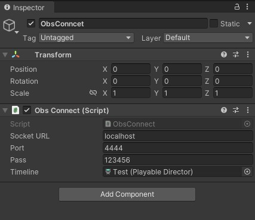
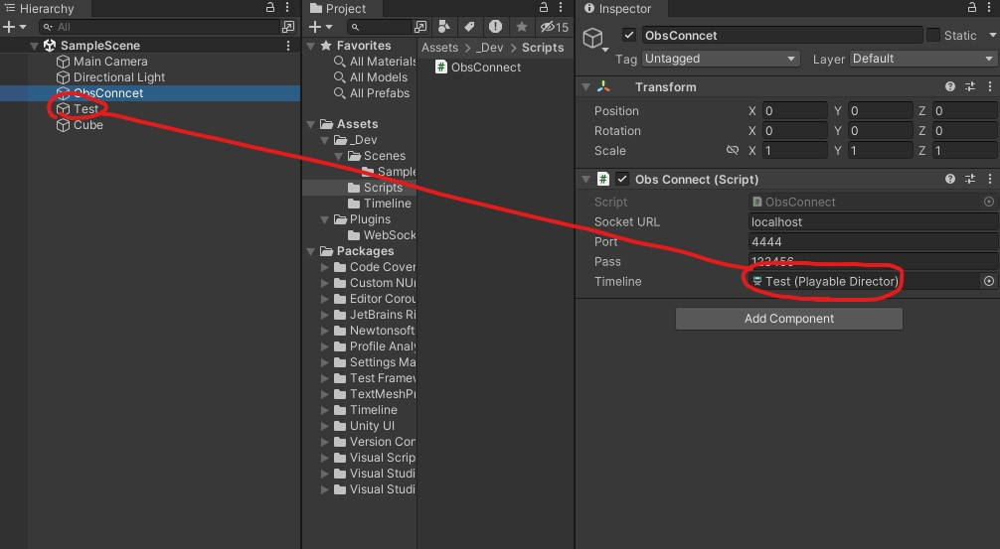
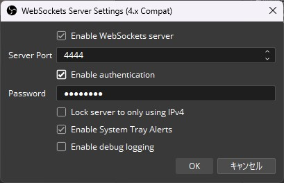

# ObsConncet

UnityTimelineの再生・停止とObsの再生・停止を同期する。

## Unity
 - `Assets\_Dev\Scripts\ObsConnect`をGameObjectにアタッチする
 
 - UnityInspector上でSocketURLを設定する
    - 同一PC場なら`localhost`もしくは`127.0.0.1`
    - 別のPCならOBSが動いているPCのIPを設定する
 - UnityInspector上で[OBSで設定したポート](#ObsWebsocketSetting)を設定する
 - 設定している場合、パスワードも入力する
 - 録画した動画の保存先はOBSで設定
 
 - Hierarchy上のPlayableDirectorをTimlineにアタッチする
 - 実行時にTimelineがアタッチされていると自動でObsに接続される
 - Timelineを再生すると録画が開始されます

### ObsWebsocketSetting

- Obs-WebSocket のプラグインを導入
  - <https://github.com/obsproject/obs-websocket/releases>  
  ※ Obs28.0以降から`webscoket5.x`が標準搭載されていますが、非対応ですので導入が必要です。

  
※画像はObs30.0で[obs-websocket-4.9.1-compat](https://github.com/obsproject/obs-websocket/releases/tag/4.9.1-compat)をインストールしたものです。  
「ツール」→「WebSocket Server Settings」で、WebSocketサーバーの設定をする